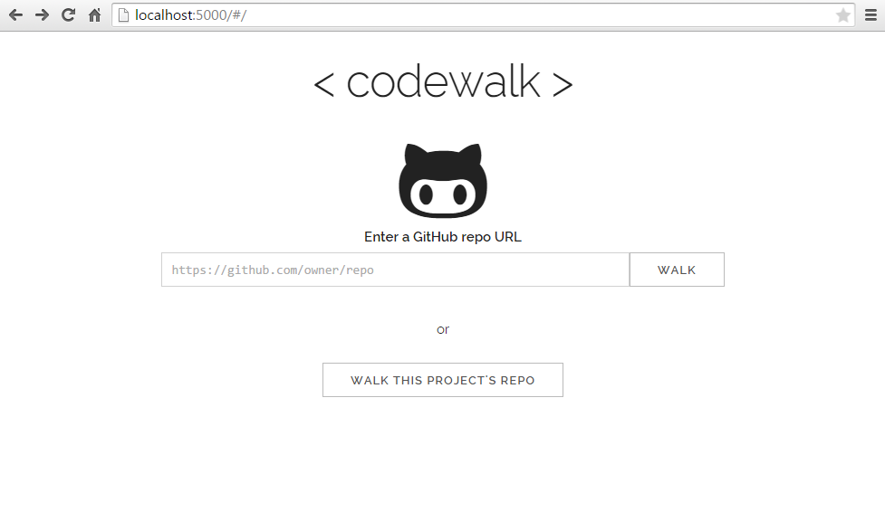
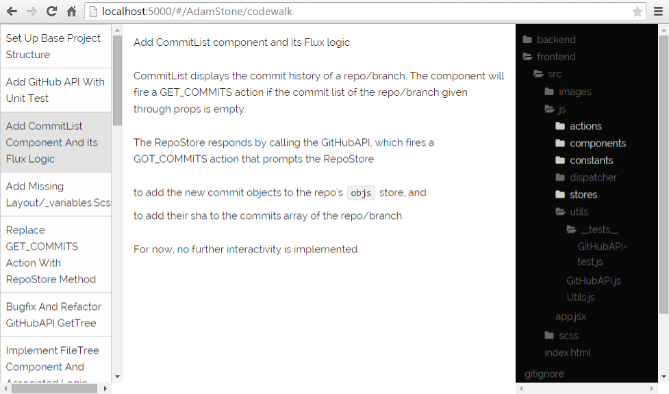

# codewalk

### Walk step-by-step through the development of code projects

Codewalk is a web application providing an alternative view of GitHub repositories that makes it easy to step through the entire history of a project and quickly view what changed with each commit.

This can be useful for any project, but its main motivation is to leverage git and GitHub as a framework for creating and hosting high quality code tutorials that walk through the process of building full applications from scratch, showing the evolution of the source code with each step.

## Demo

[Try it!](http://52.24.224.179/)

## Screenshots

### Landing page

Any GitHub repo url can be pasted in the input to walk it, or the repo for this project itself can be viewed as an example.

### Commit view

When a commit is checked out (left), the commit message is shown (center), and files that changed since the last commit (or their containing folders, if closed) are highlighted in the source code (right).

### Code view

Selecting a file opens a view of the source code that emphasizes the
lines that are new or changed since the previous commit, while preserving the usual syntax highlighting.
